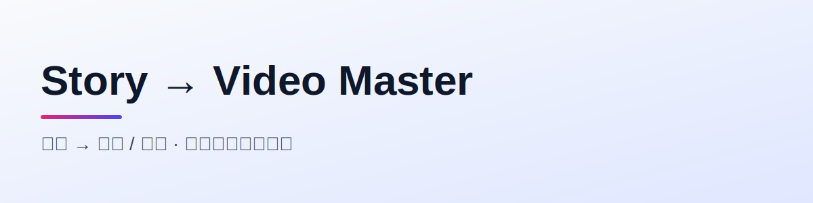

# 🎬 story-to-video-master

> **小说 → 分镜 / 短剧 · 端到端视觉化改编超级 SKILL**
>
> 把任意小说 / 书籍转化为可执行的分镜 JSON、视频组提示词、完整视频作品。
> **深度适配 `novel-master` v2 分布式创作架构**，同时支持普通小说与任意书籍文件夹。
> 内置**角色锁定冻结闸门**——用三视图链式生成 + 情绪变体 + 唯一真相源注册表，从根上消灭跨镜头脸/身材漂移。
>
> 📦 **v2.5.0 完整源码（含 8 个脚本与 9 份参考文档）已发布在 GitHub：**[`bbroot/story-to-video-master`](https://github.com/bbroot/story-to-video-master)。

<p align="center">
  <picture>
    <source media="(prefers-color-scheme: dark)" srcset="assets/banner-dark.svg">
    
  </picture>
</p>

<p align="center">
  <a href="#english">English</a> · <a href="#中文">中文</a>
</p>

<p align="center">
  <a href="https://github.com/bbroot/story-to-video-master"></a>
  <a href="LICENSE"></a>
  <a href="#-角色锁定冻结闸门"></a>
  <a href="#-三模式适配"></a>
  <a href="#-六平台适配"></a>
</p>

---

<h2 id="中文">🌟 为什么需要 story-to-video-master？</h2>

| 维度 | 手动改分镜 / 套壳提示词 | **story-to-video-master v2.5** |
|------|----------------------|-------------------------------|
| 🎯 输入来源 | 只能粘贴正文 | **三模式**：novel-master v2 项目 / 普通小说粘贴 / 任意书籍文件夹自动理解 |
| 🧩 角色一致性 | 每镜重描，跨集脸崩 | **冻结闸门**：三视图链式同人 + 情绪变体 + 注册表唯一真相源 |
| 🔗 创作闭环 | 单向输出，回不去 | **双向闭环**：直接读 novel-master 的伏笔/冲突/文风，结果可回写创作进度 |
| 🎬 平台适配 | 手敲各家提示词 | **六平台分流**：3 个可程序化自动调用 + 3 个产出可粘贴内容 |
| 📊 结构保留 | 丢了原书设定 | **继承原结构**：角色声线卡 / 偏差包 / 分卷大纲 / NCG / Plot Bus / 文风日志 |
| 🛡️ 质量门 | 靠肉眼复查 | **validate 硬闸门**：未锁定角色禁止生图 |

---

## ✨ 核心特性

### 🔒 角色锁定冻结闸门（原创质量门，详见 `references/character-locking.md`）

novel→video 最大翻车点是**同角色跨镜头脸/身材/服饰漂移**；小说改视频角色多、集数长，漂移被指数放大。本 skill 把"锁定角色"做成**不可绕过的强制闸门**：

- **唯一真相源** `output/assets/character-registry.json`：每个复用角色一条，含权威外观 `canonical_identity`、三视图路径、`seed`、`expressions` 情绪变体、`negative_constraints`、`locked` 标记。
- **同人保证（三视图链式）**：绝不独立生成三张——先生成 `front`（固定 seed），`side`/`back` 以 `front` 为参考图衍生，强制"基于这张脸衍生"，杜绝三视图不是同一人。
- **情绪变体**：`neutral / angry / sad / tense / excited / hesitant` 以 front 为参考图生成，供分镜 `@角色名-状态` 直接复用，内心戏一拍也不漂。
- **冻结校验**：`scripts/lock_character.py validate` 计算 `locked`——三视图三文件齐全 + 外观非空 + 至少 1 条约束才放行；**未锁定角色禁止进入生图**。
- **分镜 @标签解析**：`rebind` 扫描分镜 JSON，确保每个 `@角色/@角色-状态` 都能解析到锁定图，未注册 / 未锁定 / 缺变体一律报错指出缺哪张。

### 📁 三模式适配

1. **novel-master 适配模式** —— 直接读取 v2 分布式输出（角色声线卡 / 偏差包、分卷大纲、整卷章节正文、伏笔台账、冲突记录、NCG、Plot Bus、文风日志），实现从小说创作到视觉化改编的无缝闭环。
2. **普通小说模式** —— 粘贴纯文本，自动提取实体、校验篇幅、建立轻量资产。
3. **通用书籍文件夹理解器** —— `scripts/scan_book_folder.py` 读取任意书籍文件夹，自动分类（正文 / 大纲 / 设定 / 角色卡 / 分镜草稿 / 图片参考 / 音频 / 视频）并推断关系，无需固定结构也能改编。

### 🎬 六平台适配（详见 `references/platform-adapters.md`）

| 平台 | 接入方式 | 本 skill 处理 |
|------|---------|--------------|
| 即梦 Dreamina（Seedance 2.0） | 官方 CLI | `scripts/dreamina_gen.py` 自动调用 |
| LibTV（liblib.tv） | agent-im OpenAPI | `scripts/libtv_gen.py` 自动调用 |
| RunningHub | 标准 OpenAPI + ComfyUI | `scripts/runninghub_gen.py` 自动调用 |
| 小云雀 | 火山引擎企业 API（仅手动） | Phase 5 产出可粘贴剧本/提示词 |
| 随变 APP（抖音 Seedance 2.0） | 仅手机 App | 产出可粘贴分镜提示词序列 |
| Tapnow | Web 画布（仅手动） | 产出结构化分镜脚本搭建清单 |

### 🧰 八阶段工作流

```
Phase 0  书籍理解（三模式分流）        → Phase 1 故事分析（七点结构 / 钩子）
Phase 2  分集规划 + 钩子系统           → Phase 3 角色/场景资产锁定（含 3.3 冻结闸门）
Phase 4  分镜表生成（JSON + Markdown） → Phase 5 多平台方言 Transpile
Phase 6  视频生成（三自动 + 三手动）   → Phase 7 校验 + 回写创作进度
```

### 🤝 小说创作三件套（与另两个 skill 联动）

本 skill 是 **「小说创作三件套」** 的视觉化终环：

- 📝 **[novel-master](https://github.com/bbroot/novel-master)** —— 出版级小说创作（灵感 → 终稿），提供 v2 结构化产物
- 🔍 **[novel-bug-checker](https://github.com/bbroot/novel-bug-checker)** —— 叙事质量审计官，出书前消灭逻辑/角色 Bug
- 🎬 **story-to-video-master**（本仓库）—— 把成稿视觉化为分镜与视频

> 工作流：`novel-master 写书 → novel-bug-checker 审计 → story-to-video-master 改编`。
> 本 skill 直接消费前两者的产物（伏笔台账 / 冲突记录 / NCG / 文风日志），无需重新分析。

---

## 🚀 快速开始

```bash
# 1. 安装（软链到 OpenClaw skills）
ln -s ~/Documents/龙虾/story-to-video-master ~/.qclaw/skills/story-to-video-master

# 2. 在对话中触发（三模式之一）
"把 ~/Documents/龙虾/觉醒 改编成 12 集短剧分镜"   # novel-master 适配模式
"把这段小说改成短视频分镜"                          # 普通小说模式
"理解这个书籍文件夹并做改编规划"                    # 文件夹理解模式

# 3. 锁定角色（冻结闸门，生图前必跑）
python3 scripts/lock_character.py write-prompt --book <书名> --card assets/char_xxx.json
python3 scripts/lock_character.py validate --book <书名>   # 全绿才允许生图
```

> 自动生成脚本默认不主动执行付费调用；缺失 CLI / Key 时优雅报错并给出安装方式。

---

## 📂 仓库结构

```
story-to-video-master/
├── SKILL.md                       # 主技能定义（v2.5.0，八阶段工作流）
├── references/                    # 9 份方法论参考
│   ├── character-locking.md       # ★ 角色锁定冻结闸门规范
│   ├── character-bible.md         # 角色圣经（@标签注册）
│   ├── platform-adapters.md       # 六平台官方文档对照
│   ├── hook-design.md             # 钩子设计
│   ├── storyboard-spec.md         # 好莱坞分镜语法
│   ├── seven-point-structure.md   # Dan Wells 七点结构法
│   ├── continuity-methods.md      # 连续性方法
│   ├── style-presets.md           # 风格预设
│   └── novel-master-interface.md  # novel-master v2 接口
├── scripts/                       # 8 个纯标准库 Python 脚本
│   ├── load_novel.py              # Phase 0 读 novel-master v2
│   ├── scan_book_folder.py        # Phase 0 通用文件夹理解器
│   ├── parse_plain_text.py        # Phase 0b 普通小说
│   ├── build_storyboard.py        # Phase 4 分镜表
│   ├── lock_character.py          # ★ Phase 3.3 角色锁定闸门
│   ├── dreamina_gen.py            # Phase 6 即梦
│   ├── libtv_gen.py               # Phase 6 LibTV
│   └── runninghub_gen.py          # Phase 6 RunningHub
└── assets/                        # banner 等
```

---

## 📦 技术栈

- **运行环境**：OpenClaw AI Agent
- **辅助脚本**：Python 3（纯标准库，无第三方依赖）
- **格式**：Markdown + JSON
- **许可证**：MIT

---

<h2 id="english">🌟 Why story-to-video-master?</h2>

Turn any novel / book into executable storyboard JSON, video prompt packs, and finished video — with **character-consistency built in**.

- **Character Locking Gate** — chain-generated three-view sheets (front → side/back derived from front, fixed seed) + emotion variants + a single-source `character-registry.json`. `lock_character.py validate` blocks any un-locked character from entering video generation.
- **Three input modes** — native `novel-master` v2 project adapter, plain-text novel paste, or arbitrary book-folder auto-understander (`scan_book_folder.py`).
- **Six platforms** — three programmatic (即梦/Dreamina, LibTV, RunningHub) with thin wrappers, three manual-paste (小云雀, 随变 APP, Tapnow).
- **Eight-phase pipeline** — book understanding → story analysis → episode planning → asset locking → storyboard → transpile → video gen → audit & write-back.

### 🤝 The "Novel Trio"

Part of a three-skill pipeline with **[novel-master](https://github.com/bbroot/novel-master)** (write) and **[novel-bug-checker](https://github.com/bbroot/novel-bug-checker)** (audit). This repo is the visual final stage — it consumes their structured outputs (foreshadow ledger, conflict records, NCG, style log) directly.

---

## 📜 License

[MIT](LICENSE) — free to use, modify, and distribute.

<p align="center">
  Made with ❤️ by <a href="https://github.com/bbroot">bbroot</a><br>
  <sub>小说创作三件套 · 视觉化终环</sub>
</p>
